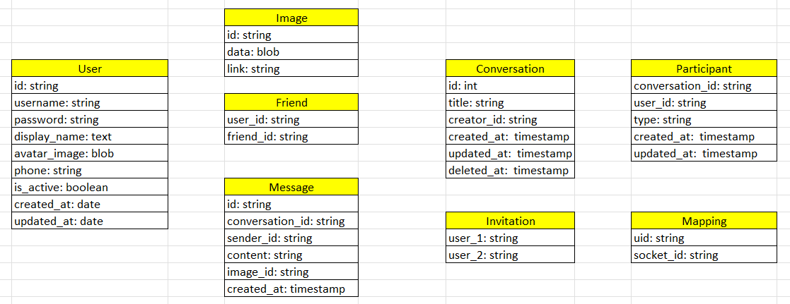
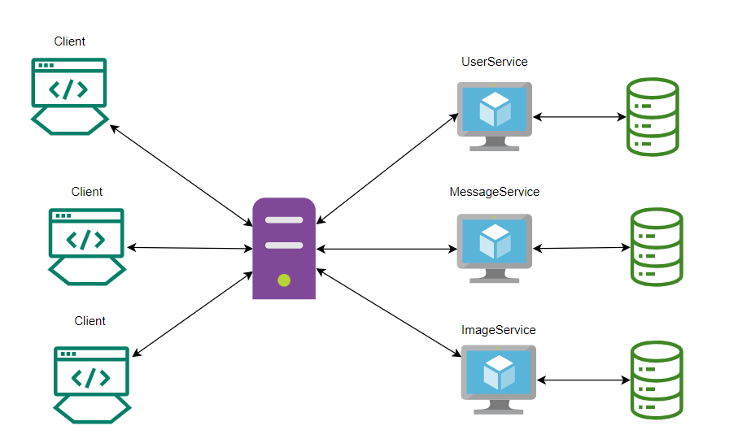
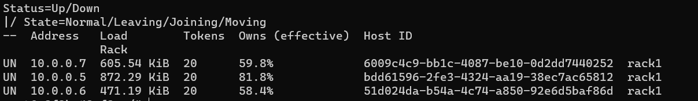
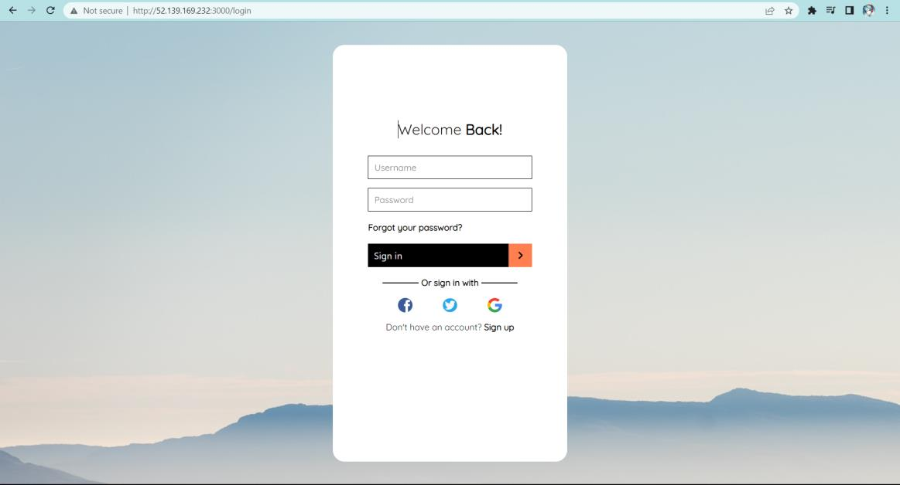
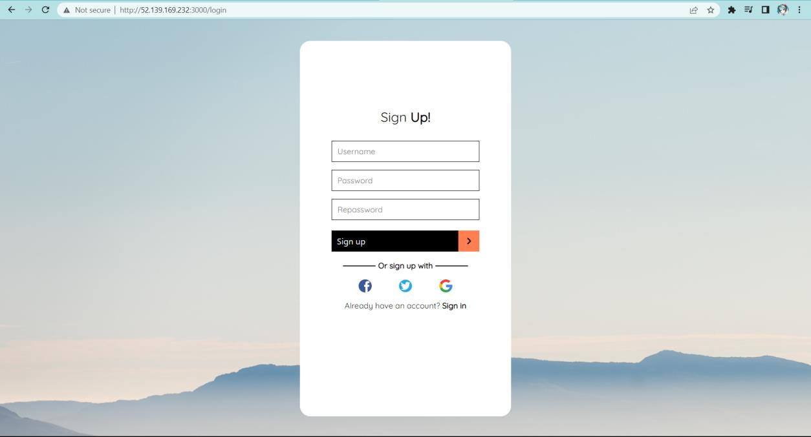
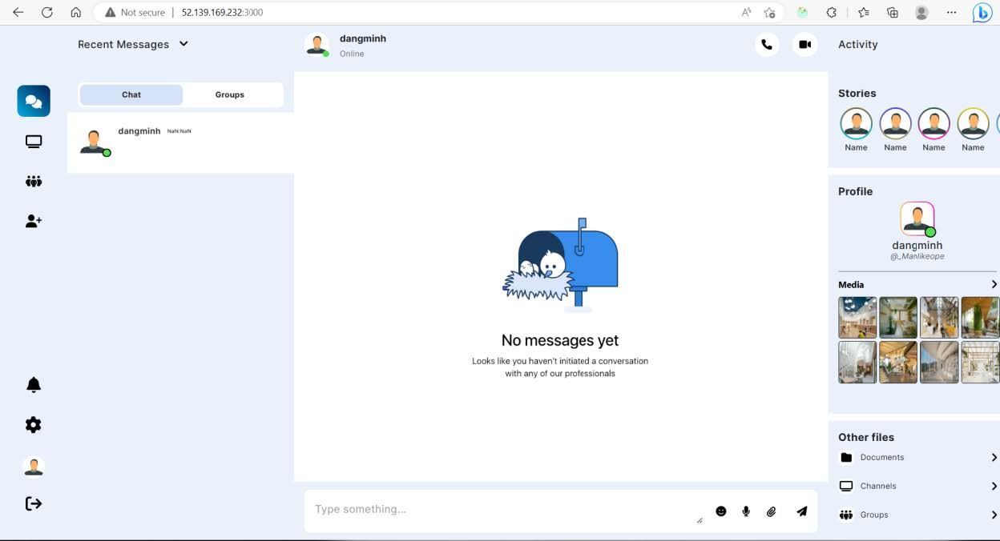
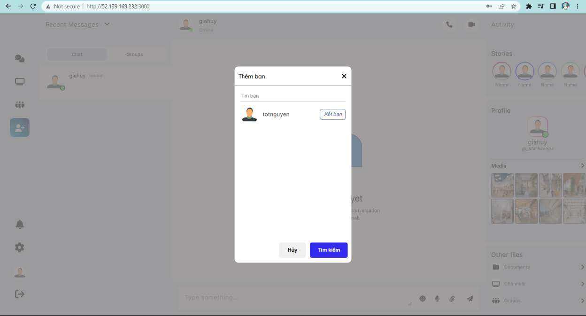
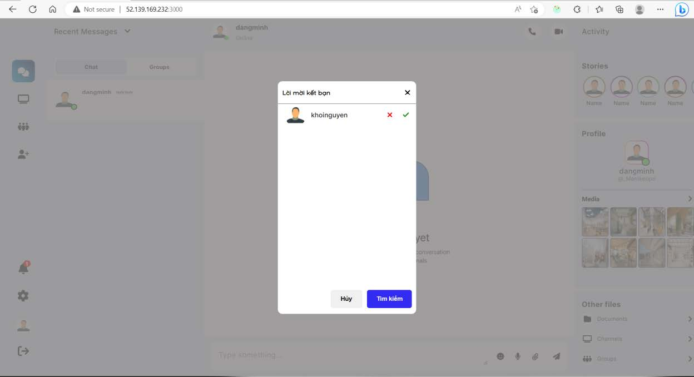
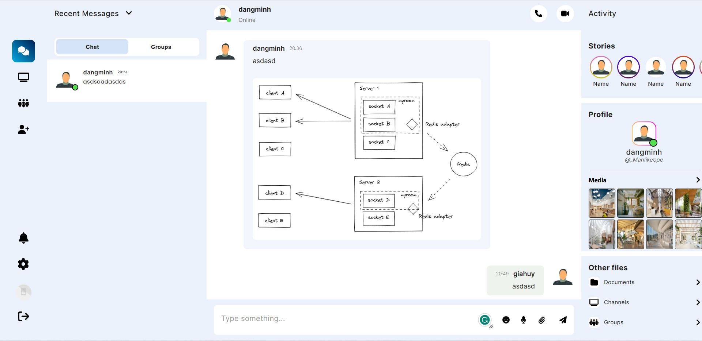

# Chat App
## Mục tiêu
Project tập trung đến việc implement hệ thống trò chuyện trực tuyến với những chức năng cơ bản như kết bạn, trò chuyện, gửi hình ảnh,..., và áp dụng hệ cơ sơ dữ liệu phân tán vào hệ thống.

## Công nghệ sử dụng
- Front-end: Reactjs
- Back-end: Expressjs, SocketIO, Docker
- Database: Cassandra
- Hosting: Azure 

## Thiết kế hệ thống
### Bảng
- Bảng User: lưu thông tin User
- Bảng Friend: Lưu mối quan hệ bạn bè
- Bảng Message: Lưu tin nhắn
- Bảng Image: Lưu hình ảnh
- Bảng Conversation: Lưu cuộc hội thoại
- Bảng Invitation: Lưu lời mời kết bạn
- Bảng Participant: Lưu id người tham gia các cuộc hội thoại
- Bảng Mapping: Lưu socket_id của một người 

  

### Kiến trúc hệ thống
Trong hệ thống, sẽ có 1 server đóng vai trò là Coordinator (người điều phối) và sẽ tương tác với 3 Service server. Cùng đảm nhận để thực hiện hiện các giao tác.
Mỗi server là một máy ảo chạy trên Cloud, bao gồm:
  - User service: quản lí các bảng User, Invitation (Lời mời kết bạn), Conversation (cuộc trò chuyện), Participant (người tham gia)
  - Message service: quản lí bảng Message (tin nhắn của các cuộc trò chuyện)
  - Database service: quản lí bảng Image (Lưu trữ hình ảnh)

  

### Database cluster
Mỗi Service sẽ có Database Server chạy trên cùng một máy ảo.
Các Database Server kết nối với nhau tạo nên 1 cụm (cluster).

  

## Hiện thực

  

<h4 align="center">Trang đăng nhập</h4>

  

<h4 align="center">Trang đăng ký</h4>

  

<h4 align="center">Trang chủ</h4>

  

<h4 align="center">Chức năng thêm bạn</h4>

  

<h4 align="center">Chức năng chấp nhận lời mởi kết bạn</h4>

  

<h4 align="center">Chức năng trò chuyện</h4>

